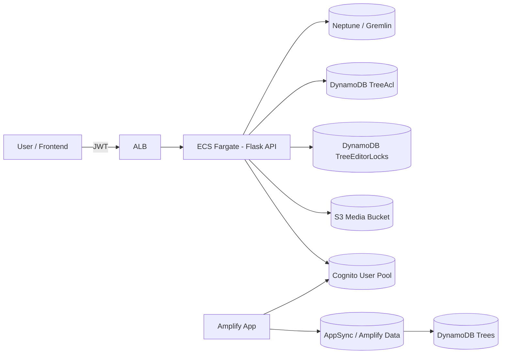
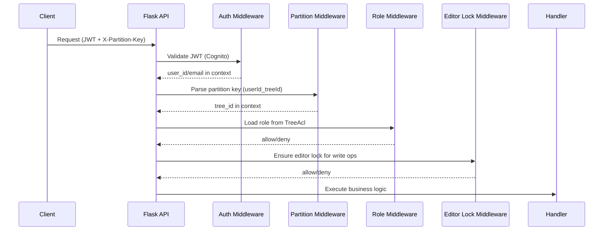
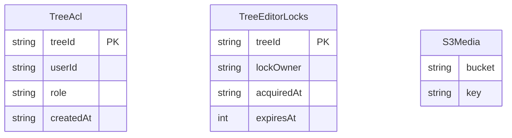
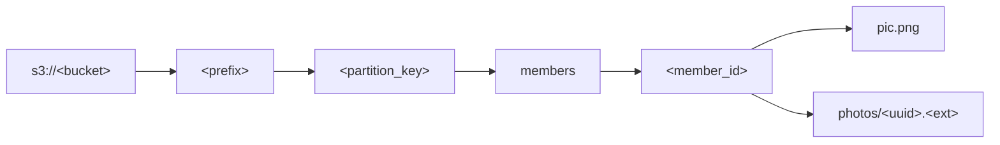

## Architecture Overview

### System Context

```mermaid
flowchart LR
    User[User / Frontend] -->|JWT| ALB[ALB]
    ALB --> ECS[ECS Fargate - Flask API]
    ECS --> Neptune[(Neptune / Gremlin)]
    ECS --> DynamoAcl[(DynamoDB TreeAcl)]
    ECS --> DynamoLock[(DynamoDB TreeEditorLocks)]
    ECS --> S3[(S3 Media Bucket)]
    ECS --> Cognito[(Cognito User Pool)]
    Frontend[Amplify App] --> Cognito
    Frontend --> AppSync[(AppSync / Amplify Data)]
    AppSync --> DynamoTrees[(DynamoDB Trees)]
```

### Request Flow (Protected Endpoints)

```mermaid
sequenceDiagram
    participant Client
    participant API as Flask API
    participant Auth as Auth Middleware
    participant Partition as Partition Middleware
    participant Role as Role Middleware
    participant Lock as Editor Lock Middleware
    participant Handler as Handler

    Client->>API: Request (JWT + X-Partition-Key)
    API->>Auth: Validate JWT (Cognito)
    Auth-->>API: user_id/email in context
    API->>Partition: Parse partition key (userId_treeId)
    Partition-->>API: tree_id in context
    API->>Role: Load role from TreeAcl
    Role-->>API: allow/deny
    API->>Lock: Ensure editor lock for write ops
    Lock-->>API: allow/deny
    API->>Handler: Execute business logic
```

### Data Stores

```mermaid
erDiagram
    TreeAcl {
        string treeId PK
        string userId
        string role
        string createdAt
    }
    TreeEditorLocks {
        string treeId PK
        string lockOwner
        string acquiredAt
        int expiresAt
    }
    S3Media {
        string bucket
        string key
    }
```

### S3 Media Key Layout

```mermaid
flowchart LR
    Bucket["s3://&lt;bucket&gt;"] --> Prefix["&lt;prefix&gt;"]
    Prefix --> Partition["&lt;partition_key&gt;"]
    Partition --> Members["members"]
    Members --> MemberId["&lt;member_id&gt;"]
    MemberId --> Pic["pic.png"]
    MemberId --> Photos["photos/&lt;uuid&gt;.&lt;ext&gt;"]
```

